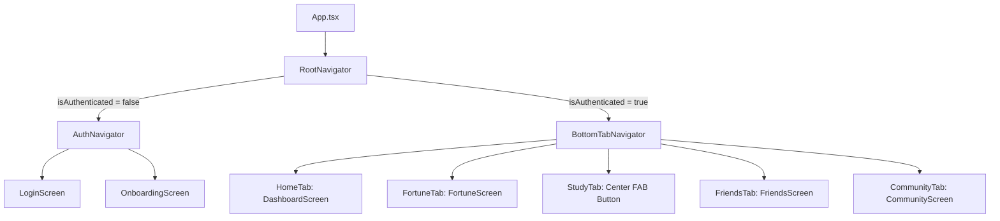

# Navigation Skill Guide (`src/navigation/`)

## 1. Directory Structure

```
src/navigation/
├── RootNavigator.tsx        # Top-level auth branching (Auth vs Main)
├── BottomTabNavigator.tsx   # 5-Tab main bottom bar with center FAB
└── AuthNavigator.tsx        # Login and Onboarding stack
```

## 2. Navigation Architecture



## 3. Implementation Guidelines

1. **Auth Branching Strategy**:
   - `RootNavigator` listens to `useUserStore((state) => state.isAuthenticated)`.
   - Dynamic conditional rendering prevents unnecessary navigation state bugs.

2. **5-Tab Layout & Floating Center FAB (Mandatory)**:
   - **Tab 1**: 운세 (`FortuneScreen` - 일일 운세 & 바이오리듬)
   - **Tab 2**: 친구 (`FriendsScreen` - 동기 듀티 동기화 & 오프 매칭)
   - **Tab 3 (Center)**: **중앙 플로팅 FAB 버튼 (홈)**
     - 탭바 위로 돌출 (`top: -16px`).
     - 비바 코랄 핑크 솔리드 배경 (`#FF507C`).
     - 원형 규격 (58x58 px, `rounded-full`), 청진기(🩺) 아이콘.
     - 부드러운 핑크 드롭 섀도우로 부각.
   - **Tab 4**: 학습 (`StudyScreen` - 임상 족보 & 실무 매뉴얼)
   - **Tab 5**: 커뮤니티 (`CommunityScreen` - 익명 게시판 & 병원 이야기)

3. **Active Color Tint**:
   - Active: `#FF507C`
   - Inactive: `#9CA3AF`
   - Bar Background: `#FFFFFF` (순백의 화이트) 및 클린 상단 보더 `#E5E7EB`.

